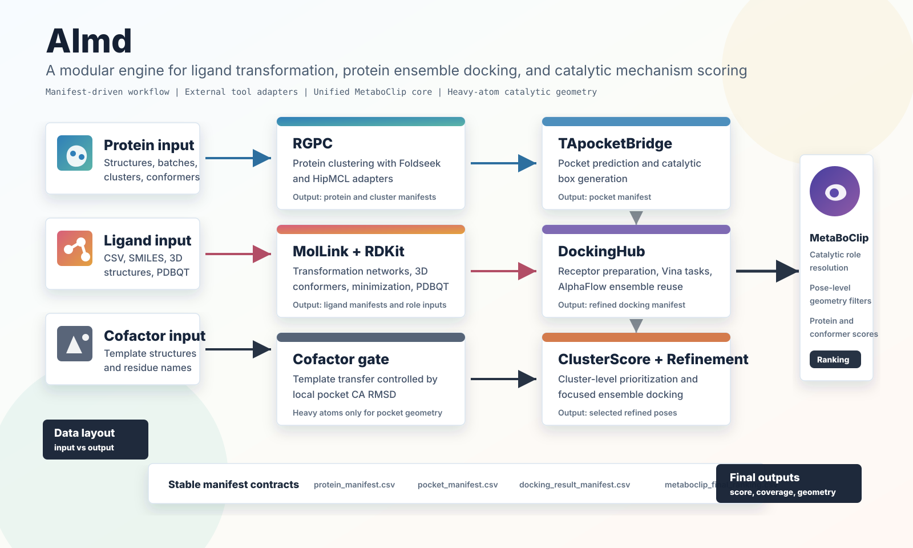

# AImd

**AImd** is a modular computational discovery package for connecting small-molecule transformation analysis, protein structural clustering, pocket prediction, ensemble docking, cofactor-aware refinement, and catalytic mechanism scoring.

<p align="center">
  
</p>

## Why AImd

AImd is designed as an end-to-end, manifest-driven engineering workflow for enzyme and ligand discovery projects where both protein conformational diversity and ligand chemistry matter. The package keeps each scientific step as a separable module, but links the modules through stable CSV manifests so that results can be inspected, resumed, replaced, or extended without rewriting the whole workflow.

Core highlights:

- **Modular architecture:** MolLink, RGPC, TApocketBridge, DockingHub, ClusterScore, RefinementHub, and MetaBoClipBridge can be run independently or as a connected workflow.
- **Protein-side structural intelligence:** Foldseek and HipMCL support protein similarity search and clustering; AlphaFlow can provide conformational ensembles for refined docking.
- **Ligand-side chemistry intelligence:** MolLink records ligand sources and transformation networks; RDKit generates minimized 3D structures and prepared docking inputs.
- **Cofactor-aware refined docking:** DockingHub can transfer cofactors only after local pocket validation, using heavy atoms for pocket detection and CA RMSD for the transfer gate.
- **Mechanism-aware catalytic scoring:** Unified MetaboClip resolves ligand roles, protein roles, catalytic geometry, pose filters, conformation scores, and final protein rankings.
- **Clean input/output separation:** `data/data_input` stores starting data, while `data/data_output` stores generated module outputs.
- **Stable deliverable conventions:** AImd preserves metadata such as `protein_id`, `ligand_id`, `conformer_id`, `pocket_id`, docking scores, role-table paths, atom-map paths, and final ranking outputs.

## Core Module Repositories

Several AImd modules are maintained as reusable companion projects:

- [MetaboClip](https://github.com/Eagan-lau/Metaboclip): mechanism-aware catalytic role resolution, geometry filtering, and final scoring.
- [TApocket](https://github.com/Eagan-lau/TApocket): catalytic pocket prediction and pocket-box generation.
- [MolLink](https://github.com/Eagan-lau/MolLink): ligand source handling and transformation-network construction.

The active workflow is:

```text
MolLink -> RGPC -> TApocketBridge -> DockingHub -> ClusterScore -> RefinementHub -> refined DockingHub -> MetaBoClipBridge
```

MetaboClip is a core scientific component of AImd. `MetaBoClipBridge` calls the unified MetaboClip core under `metaboclip_unified`; the old implementation is not part of the clean deliverable package.

## Module Map

| Module | Scientific role | Main inputs | Main outputs |
| --- | --- | --- | --- |
| [`MolLink`](https://github.com/Eagan-lau/MolLink) | Ligand source handling and transformation-network construction | `data/data_input/ligand/taxane_molecules.csv` | `data/data_output/ligand_transformation/ligand_source_manifest.csv` |
| `RGPC` | Protein structure batching, similarity search, and clustering | `data/data_input/protein/file_*/*.pdb` | `data/data_output/protein_batches/protein_manifest.csv`, cluster outputs |
| [`TApocketBridge`](https://github.com/Eagan-lau/TApocket) | Pocket prediction or template-guided catalytic box generation | protein manifest | `data/data_output/pocket/pocket_manifest.csv` |
| `DockingHub` | Ligand preparation, receptor preparation, docking task generation, Vina execution | ligand, protein, pocket manifests | receptor, task, and docking result manifests |
| `DockingHub` cofactor gate | Conservative cofactor transfer using local pocket validation | target structures and cofactor templates | `data/data_output/refined/cofactor_mapped/cofactor_manifest.csv` |
| `ClusterScore` | Cluster-level docking summary and candidate prioritization | broad docking results | `data/data_output/scoring/ClusterScore/top10_clusters.csv` |
| `RefinementHub` | Selected-cluster refined docking orchestration | ClusterScore outputs | refined DockingHub config and refined docking results |
| [`MetaBoClipBridge`](https://github.com/Eagan-lau/Metaboclip) | Unified MetaboClip staging, role-table handling, catalytic geometry filtering, and final scoring | refined docking manifest and ligand role assets | `data/data_output/metaboclip/results/metaboclip_final_ranking.csv` |

## What AImd Produces

A successful run produces inspectable artifacts at each level:

- ligand transformation manifests and optional transformation networks
- protein cluster and protein batch manifests
- pocket manifests with docking boxes
- ligand preparation outputs with SDF, PDB, and PDBQT structures
- receptor manifests, docking task manifests, Vina logs, and pose PDBQT files
- cofactor validation reports with local pocket RMSD, coverage, and transfer status
- MetaboClip role tables, annotations, atom maps, geometry features, candidate scores, conformation scores, protein scores, and final rankings

## Quick Start

```bash
cd AImd
pip install -r requirements.txt
python scripts/migrate_data_layout.py --root .
python validate_aimd_layout.py --root .
```

## Data Layout

AImd uses a strict two-part data layout:

```text
data/
  data_input/
    protein/       # starting protein structures
    ligand/        # starting ligand tables, structures, and ligand manifests
    cofactor/      # optional cofactor templates
    workflow/      # pair lists, family maps, and manual workflow tables
  data_output/
    cluster/
    protein_batches/
    ligand_transformation/
    pocket/
    ensemble/
    cofactor_mapped/
    receptor/
    docking_configs/
    docking_tasks/
    docking_out/
    scoring/
    refinement/
    refined/
    metaboclip/
```

`data_input` is for user-provided starting files only. `data_output` is for files generated by AImd modules. If a local package still has legacy `data/protein_input`, `data/ligand_input`, or `data/input` folders, run:

```bash
python scripts/migrate_data_layout.py --root .
```

The migration helper copies local inputs into the canonical layout and writes project-root-relative input manifests. It does not delete legacy folders.

Run the deterministic MetaboClip bridge smoke test:

```bash
PYTHONDONTWRITEBYTECODE=1 PYTHONPATH=.:metaboclip_unified \
  python -m pytest tests/test_metaboclip_bridge_smoke.py -q
```

Run the full workflow only after all required inputs and external tools are available:

```bash
conda deactivate
conda activate aimd
python run_full_iterative_metaboclip.py \
  --config configs/workflows/full_iterative_metaboclip.yaml
```

Run modules individually:

```bash
python run_mollink.py --config configs/MolLink/mollink.yaml
python run_rgpc.py --config configs/RGPC/rgpc.yaml
python run_tapocket_batch.py --config configs/TApocket/tapocket_batch.yaml
python run_docking.py --config configs/Docking/docking.yaml
python run_clusterscore.py --config configs/Scoring/cluster_score.yaml
python run_refinement.py --config configs/Refinement/refine_from_clusterscore.yaml
python run_metaboclip_bridge.py --config configs/MetaBoClip/metaboclip_bridge.yaml
```

TApocket template mapping requires PyMOL to be importable from the Python environment that runs `run_tapocket_batch.py`. The DeepPocket-DB fallback uses the same Python executable that runs AImd by default; custom AI commands should use the `{python_executable}` placeholder instead of a hard-coded `python`. The packaged AI fallback defaults to CPU for portable execution; set the TApocket AI device to `cuda` only on a compatible GPU runtime.

## MolLink Integration

The active MolLink configuration is:

```text
configs/MolLink/mollink.yaml
```

The bundled minimal ligand input is:

```text
data/data_input/ligand/taxane_molecules.csv
```

MolLink writes ligand source and transformation-network outputs under:

```text
data/data_output/ligand_transformation/
```

The stable ligand source manifest is:

```text
data/data_output/ligand_transformation/ligand_source_manifest.csv
```

When a reaction template file is configured and present, the wrapper calls the migrated MolLink template-based TransformNet logic. When only the molecule CSV is available, the wrapper completes in `csv_only_no_template` mode and writes an empty transformation network instead of inventing reaction edges.

DockingHub prepares the docking ligand manifest from the molecule CSV by generating RDKit 3D conformers, minimizing them with MMFF or UFF, and converting the prepared molecules to PDBQT:

```text
data/data_output/ligand_preparation/ligand_manifest.csv
```

DockingHub can optionally call AlphaFlow as a third-party conformational ensemble generator before receptor preparation and docking. Installation and configuration details are in:

```text
docs/ALPHAFLOW_INTEGRATION.md
```

## MetaboClip Integration

The active MetaboClip configuration is:

```text
configs/MetaBoClip/metaboclip_bridge.yaml
```

The bridge consumes the refined docking manifest:

```text
data/data_output/refined/docking_out/docking_result_manifest.csv
```

It preserves AImd metadata, prepares unified backend inputs, handles ligand role tables, calls `metaboclip.core.workflow.run_directory`, and writes AImd-compatible outputs under:

```text
data/data_output/metaboclip/results/
```

The stable final ranking path is:

```text
data/data_output/metaboclip/results/metaboclip_final_ranking.csv
```

Unified backend run artifacts are written under:

```text
data/data_output/metaboclip/unified_runs/
```

## Role Tables

`role_tables.mode` supports:

```text
existing
generate
auto
```

`existing` reuses prebuilt role tables. `generate` builds role tables from original ligand source files and prepared ligand PDBQT files. `auto` reuses existing role tables and generates only missing ones when source inputs are available.

Role generation uses the unified ligand role APIs and records:

```text
role_table_path
annotation_json_path
atom_map_json_path
```

Downstream catalytic geometry uses heavy atoms only. Ligand hydrogen atoms may be used by the unified role detector for functional-group recognition, but hydrogen coordinates are not used for downstream catalytic geometry.

## Documentation

Primary documents:

```text
docs/AImd_RUN_GUIDE.md
docs/AImd_USER_MANUAL.md
docs/MODULE_INTERFACE_SPEC.md
docs/aimd_manifest_interface_spec.md
docs/ENGINEERING_CHECK_REPORT.md
```

## Third-Party Tools

AImd keeps external tool metadata under `third_party/`. To check command availability:

```bash
python third_party/check_tools.py --config third_party/tools.yaml --root .
```

PyMOL is not required for core unified MetaboClip scoring. It is optional for visualization/export paths or other modules that explicitly use it.
